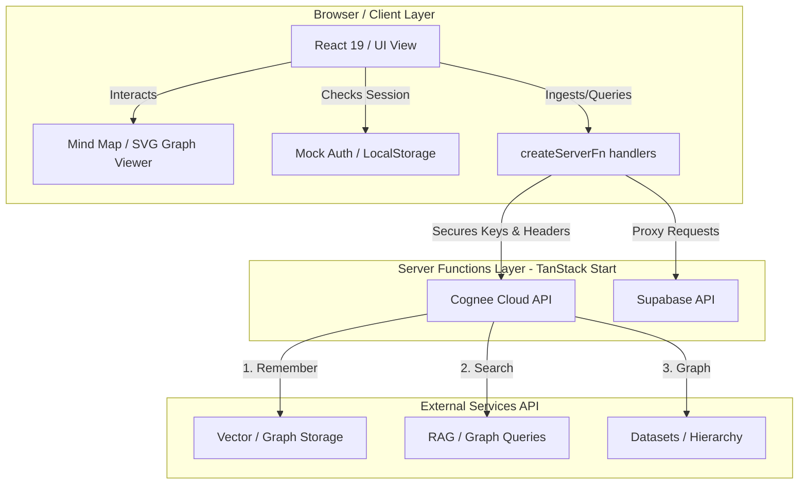

# StudyMemo 🧠

> **"Never get a different answer twice."**

StudyMemo is a state-of-the-art, persistent-memory AI study companion powered by **Cognee Cloud RAG** and **TanStack Start**. It is designed to act as your ultimate personalized knowledge base—ingesting notes, slides, and papers, indexing them into structured datasets, and rendering interactive knowledge graphs. 

StudyMemo ensures that every question you ask receives consistent, context-grounded, source-cited responses that match your study material and past learning history.

---

## 🌟 Key Features

### 1. **Intelligent Memo AI Chat Workspace**
* **Grounded RAG Search:** Choose between various query mechanisms (such as `GRAPH_COMPLETION`) to obtain responses verified against your notes.
* **Source Citations:** View exactly which uploaded document and context snippet backed the AI’s response.
* **Adjustable Answer Length:** Toggle output verbosity directly in the chat panel (`Short`, `Auto`, or `Long`) to fit your immediate study needs.
* **One-Click Summarization:** Instantly condense complex, lengthy AI responses into one short, direct sentence.

### 2. **Cognitive Subjects & Dataset Management**
* Create, list, and delete distinct custom workspaces (subjects) to organize your learning material.
* Upload plaintext files, markdown notes, or PDF documents directly into specific subjects.
* Full integration with Cognee's `/remember` ingestion pipeline for automated entity extraction and concept mapping.

### 3. **Interactive Knowledge Graph & Mind Map**
* Visual representations of your custom datasets, rendering interactive node-edge diagrams mapping **Subjects**, **Chapters**, **Concepts**, and **Mistakes**.
* Visual clustering shows the relationship between your notes, terms, and the user entity to visualize knowledge paths.
* Pan, zoom, and search nodes dynamically to trace syllabus coverage.

### 4. **Question Bank & Revision Deck**
* Automatically archives your past search history into a searchable, categorized library of study cards.
* Smart revision decks let you run study sessions (using spaced repetition models like "Got it", "Almost", or "Still learning").
* Track study streaks, questions asked, and syllabus coverage dynamically computed from graph density.

### 5. **Enhanced Custom Markdown Compiler**
StudyMemo features a highly tailored markdown compiler (`src/components/studymind/Markdown.tsx`) that processes notes and chat responses dynamically with:
* **Emoji Shortcodes:** Translates codes (e.g. `:bulb:` 💡, `:fire:` 🔥, `:rocket:` 🚀, `:check:` ✅) to visual emojis.
* **Tables:** Complete pipe-table styling and alignment matching the custom theme.
* **Task Lists:** Renders standard `- [ ]` and `- [x]` markdown checklists.
* **Footnotes & References:** Compiles inline references (`[^1]`) and outputs styled anchor links mapping to defined footnotes sections.
* **Inline Elements:** Renders highlights (`<mark>`), bold (`**`), italics (`*`), strikethroughs (`~~`), and formatted inline code block elements.

## 📐 Architecture

StudyMemo is designed with a modern decoupled structure, separating concerns across client interactions, secure server-side logic execution, and external AI/database integrations.



### Architectural Pillars

1. **Client / UI Presentation Layer:**
   - **React 19 & TypeScript:** Builds interactive single-page views styled using Tailwind CSS v4.
   - **Interactive Graph Rendering:** Draws coordinates and nodes (`src/routes/question-bank.tsx`) to render dynamic, interactive SVG diagrams displaying datasets as structured maps (Subjects &rarr; Chapters &rarr; Concepts &rarr; Mistakes).
   - **Spaced Repetition Engine:** A client-side deck manager handles user reviews and card scoring.

2. **Secure Server Functions Layer (TanStack Start):**
   - Implements type-safe server-side routes using `createServerFn` (e.g. in `src/lib/cognee.ts`).
   - Securely proxies client inquiries to Cognee Cloud APIs, encapsulating credential payloads and preventing leakage of sensitive properties (such as the `COGNEE_API_KEY`) to browser networks.

3. **Cognitive RAG & Vector Engine (Cognee Cloud):**
   - **Remember Flow (`/api/v1/remember`):** Uploaded data blobs are parsed, metadata is indexed, and entities/relationships are extracted to build a structured cognitive memory graph.
   - **Search Flow (`/api/v1/search`):** Grounded search queries (e.g., using `GRAPH_COMPLETION` or `RAG_COMPLETION`) parse the vector databases and the graph model to return exact references and sources.
   - **Graph Extraction Flow (`/api/v1/datasets/{id}/graph`):** Exposes JSON nodes and edges representing the database hierarchy to populate the SVG viewer.

4. **Persistence & Session Management (Supabase / LocalStorage):**
   - Integrated with standard Supabase client interfaces.
   - Implements a resilient mock-session provider (via `localStorage` caching) which guarantees that local setups can test dashboard features, timeline tracking, and subject management seamlessly offline.

---

## 🛠️ Tech Stack

* **Frontend Framework:** [React 19](https://react.dev/) & [TypeScript](https://www.typescriptlang.org/)
* **Routing & SSR:** [TanStack Start](https://tanstack.com/router/v1/docs/start/overview) (incorporating file-based routing and Server Functions)
* **Design & Styling:** [Tailwind CSS v4](https://tailwindcss.com/) & custom glassmorphism primitives
* **RAG & Knowledge Graph Engine:** [Cognee Cloud API](https://api.cognee.ai)
* **Auth & User Database:** [Supabase](https://supabase.com/) (with local mock fallback for quick prototyping)
* **Package Manager & Build Engine:** [Bun](https://bun.sh/)

---

## ⚙️ Environment Configuration

To run StudyMemo locally, copy `.env.example` into a `.env` file in the project root:

```bash
cp .env.example .env
```

Define the following environment variables:

| Variable | Description |
| --- | --- |
| `COGNEE_API_KEY` | Your Cognee Cloud API key (typically starts with `f6389dfb...`) |
| `COGNEE_API_URL` | The Cognee API URL (defaults to `https://api.cognee.ai` or your custom tenant endpoint) |
| `COGNEE_TENANT_ID` | Your Cognee tenant ID |
| `VITE_SUPABASE_URL` | *(Optional)* The URL of your Supabase project |
| `VITE_SUPABASE_ANON_KEY` | *(Optional)* The anonymous key of your Supabase project |

> [!NOTE]
> If `COGNEE_API_KEY` is omitted, the application will automatically run in a functional **Mock Mode** powered by `localStorage`. This allows you to explore the dashboard, knowledge graphs, and workspace functionality without immediate api credentials.

---

## 🚀 Getting Started

### 1. Install Dependencies
```bash
bun install
```

### 2. Start the Development Server
```bash
bun run dev
```
Open [http://localhost:3000](http://localhost:3000) in your browser to view the application.

### 3. Build for Production
```bash
bun run build
```

---

## 📁 Repository Structure & Routes

### Route Map (`src/routes/*`)
StudyMemo uses file-based routing convention of TanStack Router:

```
src/routes/
├── __root.tsx          # Main application layout, theme wrapper, and navbar
├── index.tsx           # Home landing page with values, FAQ, and testimonials
├── sign-in.tsx         # User authentication login portal
├── sign-up.tsx         # User authentication registration portal
├── dashboard.tsx       # Main dashboard: statistics, coverage, and weak concepts
├── memo.tsx            # Chat workspace, uploads, and Cognee integrations
├── question-bank.tsx   # Integrated Question Bank, Knowledge Graph, and Flashcards
├── timeline.tsx        # Activity history and query logs timeline
├── about.tsx           # About StudyMemo background & team values
└── guide.tsx           # Quick-start documentation and user manual
```

### Supporting Folders
* **`src/components/studymind/`**: Core reusable UI component primitives, custom footer, navbar, and the `Markdown` compiler.
* **`src/lib/`**:
  * `cognee.ts` - All Cognee API client configurations and `createServerFn` integrations.
  * `supabase.ts` - Supabase client setup.
  * `utils.ts` - Standard utility helpers (e.g. Tailwind class merge).
* **`src/context/`**: Contains `AuthContext.tsx` providing authentication state and mock profile database syncing.
* **`src/data/`**: Houses static layout details, testimonials list, FAQ metadata, and mock templates.

---

## 📝 Custom Markdown Syntax Reference

The table below outlines the custom compilation behavior supported by our enhanced markdown engine:

| Markdown Syntax | Output Style / Description |
| --- | --- |
| `:bulb:` / `:fire:` / `:rocket:` | Replaced inline with 💡 / 🔥 / 🚀 |
| `==text==` or `<mark>text</mark>` | Highlighted text component with colored background tags |
| `~~strikethrough~~` | Strikethrough text in gray font |
| `- [ ] Task Item` | Interactive custom unchecked checklist item |
| `- [x] Task Item` | Custom checked list item (strikethrough & lighter font) |
| `[^1]` ... `[^1]: Note` | Styled superscript anchor referencing footnote section at the bottom of the content |
| `\| Header 1 \| Header 2 \|` | Fully formatted grid table layout |

---

## 📝 License

Distributed under the GNU GPL License. See [LICENSE](file:///d:/Projects/cognee%20hackathon/New%20folder/ExamMemory/LICENSE) for more information.
